# FetchRecipe App (Take Home Assignment)

# Summary:

## Tech Stack:
- **Frontend**: SwiftUI, Lottie (Graphic Animation), Adobe (Logo)
- **Backend**: Swift, Gemini API
- **Development**: XCode, Git, AppStoreConnect

### App Store: [https://apps.apple.com/app/id6741867800](https://apps.apple.com/app/id6741867800)

### App Video: https://youtu.be/NXT0ko7BBfY

[](https://youtu.be/NXT0ko7BBfY)


### iOS Snippets

#### 1. Search and Filter
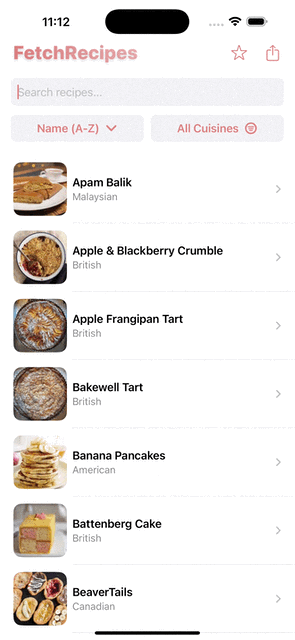

#### 2. Recipe Detail View


#### 3. Recipe AI View
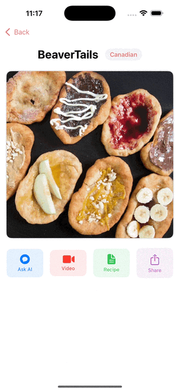


### iPad Screenshots
<div style="display: flex; justify-content: space-around;">
  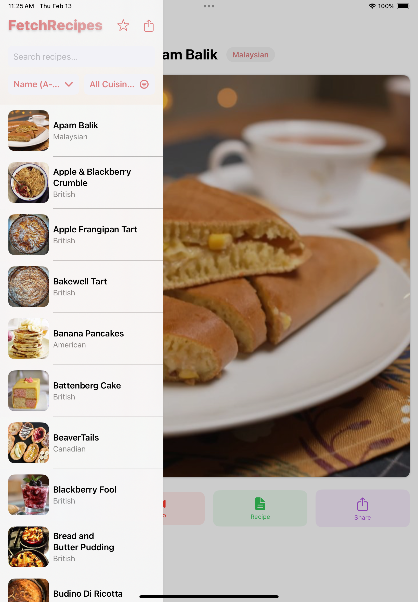
  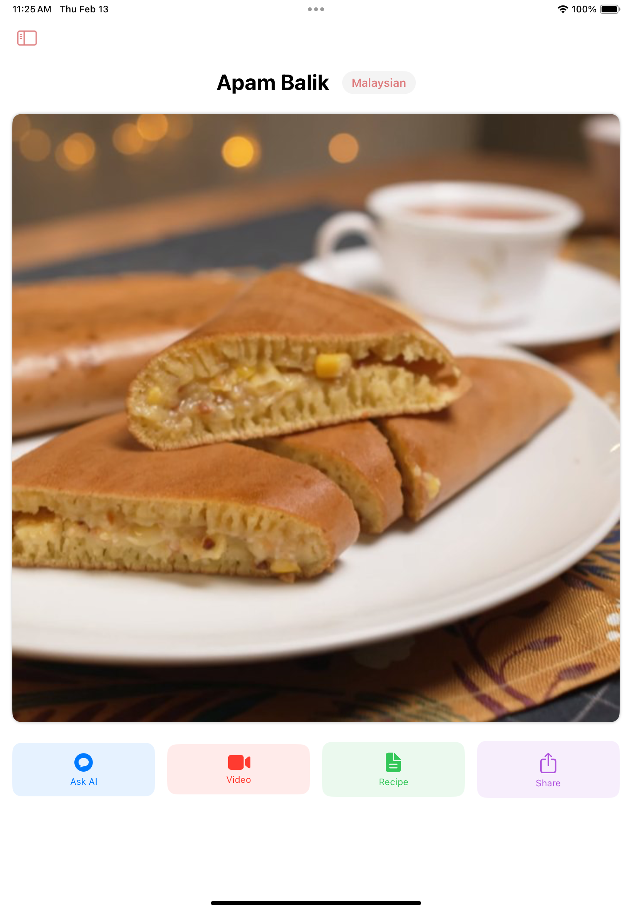
  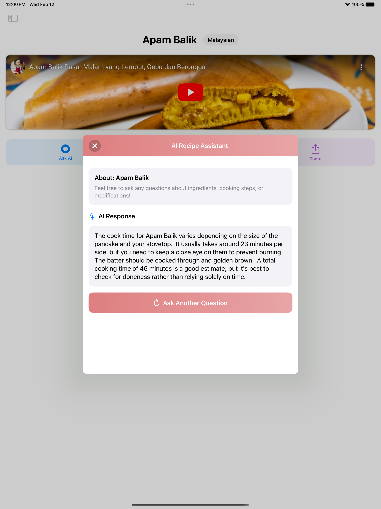
</div>


### watchOS Screenshots (Very Basic)
<div style="display: flex; justify-content: space-around;">
  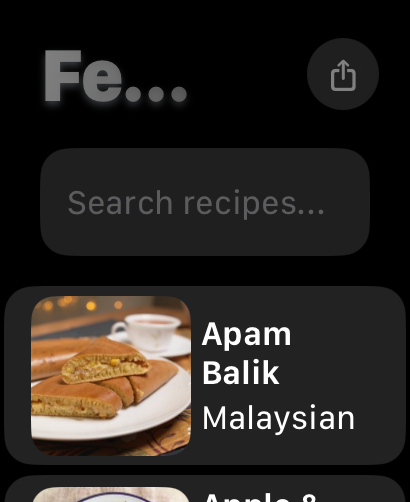
  
  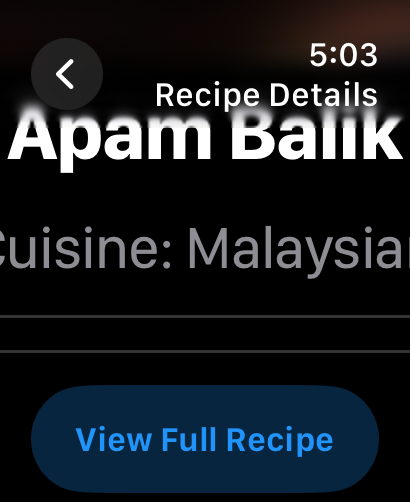
</div>

### MacOS Screenshots
<div style="display: flex; justify-content: space-around;">
  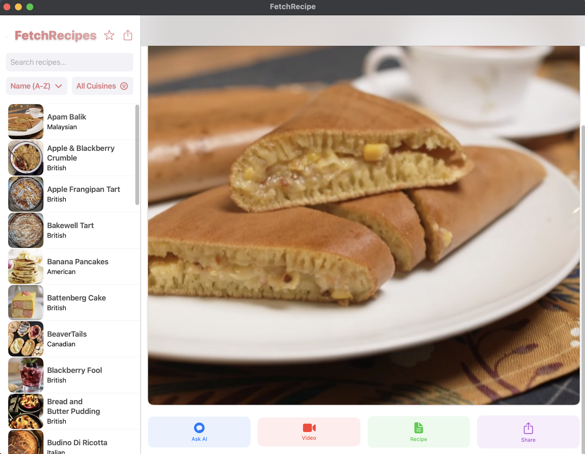
  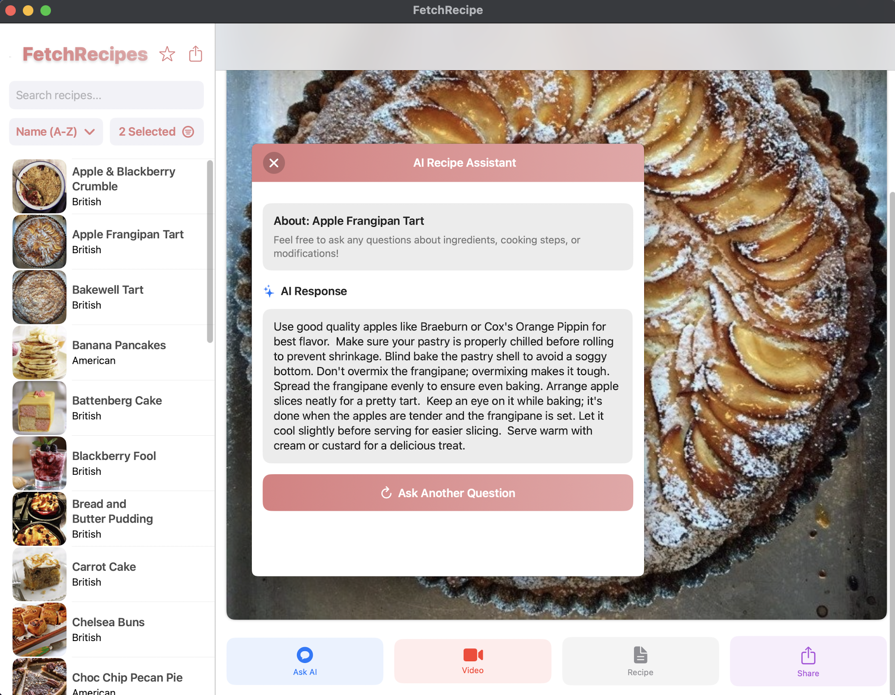
  
</div>

### Handoff Screenshots
<div style="display: flex; justify-content: space-around;">
  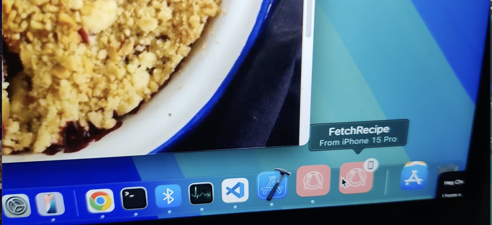
  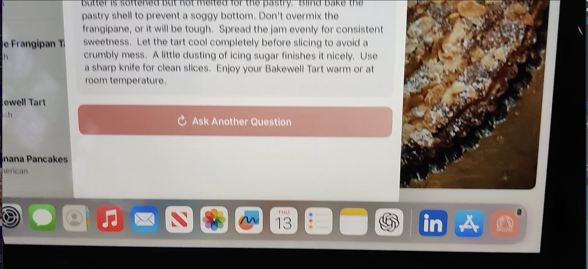
</div>


## Focus Areas:
1. **Gemini API Integration**: Provides contextual information to users, enabling them to query any recipe-related information.
2. **Multi-Platform Support**: Developed for **iOS**, **iPadOS**, **watchOS**, and **MacOS**.
3. **Sharing Functionality**: Allows users to easily share recipes with friends.
4. **Handoff Support**: Seamless device transitions between Apple ecosystem devices.
5. **Search & Filter**: Efficient search and filter functionality to help users find the perfect recipe.

## Time Spent: 

| **Task**                                                                                             | **Estimated Time**   |
|------------------------------------------------------------------------------------------------------|----------------------|
| Developed the Fetch Recipe App using SwiftUI for the frontend and Gemini API for fetching recipes.   | ~3-4 hours           |
| Implemented the recipe search, sort and filter functionality.                                        | ~1-2 hours           |
| Configured the app for deployment on iOS, iPadOS, macOS, and watchOS platforms.                      | ~2-3 hours           |
| Implemented App Store deployment process.                                                            | ~1-2 hours           |
| Worked on optimizing UI, improving code, test cases, caching mechanism and device handoff            | ~4-6 hours           |
| Video, Readme, Documentation                                                                         | ~1-2 hours           |


## Trade-offs and Decisions:

| **Decision**                                                                                         | **Trade-off**                           |
|------------------------------------------------------------------------------------------------------|-----------------------------------------|
| I decided to manually deploy my app, build it locally, and upload it to App Store Connect since I don't plan to deploy frequently. | Increased manual effort and time investment. |
| I chose not to focus on optimizing the UI for other platforms at this stage.                        | Limited cross-platform user experience and potential delays for other platforms. |
| I stored the API key in the app bundle, which could be easily reverse-engineered. The correct approach would have been to store it on a server and implement rate limiting. Currently, the API key is stored in `Info.plist`, which is not committed to GitHub, and is shared via email. | Potential security vulnerability due to hardcoding the API key in the app bundle. |


## Weakest Part of the Project:

- **API Key Management**: Storing the API key in `Info.plist` exposes it to reverse engineering. It should be handled via a secure server with rate limiting.
  
- **Cross-Platform UI Optimization**: Limited UI optimization for different platforms, which could affect the user experience.

- **Unit Testing**: Lack of thorough unit tests due to limited experience, which could affect app reliability and maintainability.


## Additional Information:

### Setup Instructions:
1. **Clone the repository****
   ```
   git clone https://github.com/nuttysunday/Fetch-Recipe-iOS-app
   ```
2. **Install Lottie SPM:**
    ```
   Open your Xcode project.
   Go to File -> Swift Packages -> Add Package Dependency.
   Enter the Lottie GitHub repository URL:  https://github.com/airbnb/lottie-spm
   ```
3. **Google Gemini API Key**
    To access the Gemini API, follow these steps:

    1. Use the Info.plist from the email I sent you, or
    2. Visit [website](https://aistudio.google.com/app/apikey) to create your own API key.

    Once you have your API key, add it to the `Info.plist` file in your project:

    ```
    <key>Gemini_api_key</key>
    <string>Your_API_Key_Here</string>
    ```

    
    **FEEL FREE TO CALL ANYTIME : 919-637-1219 OR sghodke@ncsu.edu**
    **If API key is needed or some problem arises.**


### Future Plans:
1. **Chat Format**: Store query data in a **chat format** for improved interaction.
2. **Internal Framework**: Build an internal framework for shared codebases across platforms.
3. **UI Optimization**: Tailor the UI for each platform to ensure a consistent user experience.
4. **CI/CD Pipeline**: Set up a Xcloud CI/CD pipeline to deploy the app automatically to TestFlight after code is pushed to the main branch for beta testing.